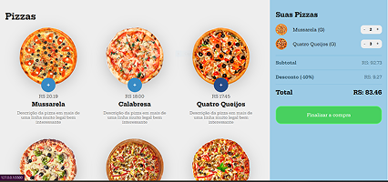

# Projeto Pizza

<<<<<<< HEAD
Projeto criado durante o curso de **JavaScript** na B7web, com o objetivo de desenvolver um catálogo interativo de pizzas que permitisse ao usuário escolher sabor, tamanho, adicionar itens ao carrinho e visualizar o valor total do pedido em tempo real.
Utilizando **HTML** para estruturação, **CSS** para estilização e layout responsivo, e **JavaScript** para lógica de negócio, controle do carrinho e interatividade.

---
<div></div>

*[link do projeto ](https://thiag519.github.io/projeto_pizza/)*

## Tecnologias utilizadas

### HTML, CSS e JavaScript


## Estrutura do projeto

```
├── images/        # Imagens e ícones 
├── index.html     # Estrutura da página 
├── pizzas.js      # Arquivos do catálogo
├── script.js      # lógica e interatividade
└── style.css      # Estilização da pagina
```

## Como executar o projeto

#### No terminal

1. Clone este repositório:

Copiar código:

``git clone https://github.com/seu-usuario/projeto_pizza.git``

2. Acesse a pasta do projeto:

Copiar código:

``cd projeto_pizza``

3. Formas de visulizar o projeto:

- Use a extensão **Live Server** no **VScode**.

- Localize a pasta onde esta o arquivo e abra o arquivo **index.html** no seu navegador.

=======
*[Visualize o site](https://thiag519.github.io/projeto_pizza/)*

---

<h3>
                            Este projeto consiste em um catálogo interativo de pizzas 
                            para uma pizzaria, desenvolvido ultilizando HTML5, CSS3 e JavaScript.
                                O site apresenta um design responsivo, permitindo que os usuários
                            visualizem as opçôes de pizzas, consultem os preços e adicione itens ao
                            carrinho.               
</h3>

--- 


>>>>>>> eb76366e591cfbd7a788dcdd23d96f96c8a98672

